# Du piano au clavier midi
## Le piano

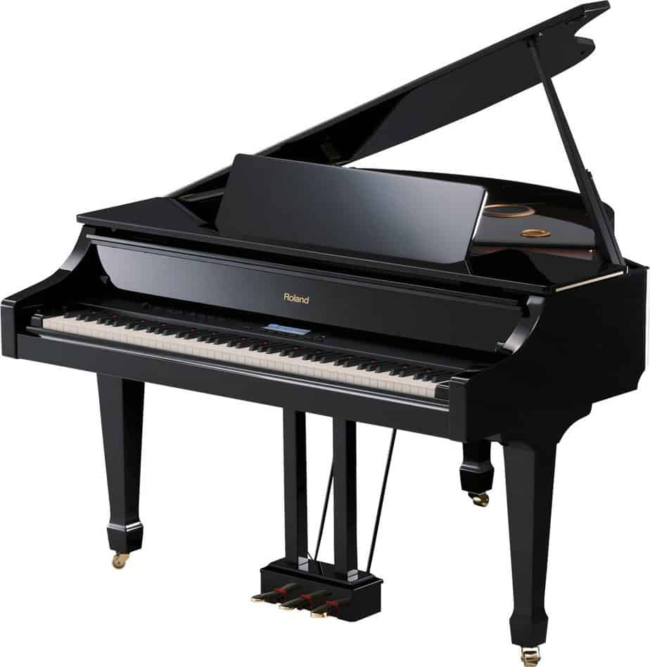

### L'histoire
En 1711, l'écrivain italien Scipione Maffei publie la première version du piano incluant son mécanisme (gravecembalo col piano e forte) qu'il a observé 2 ans avant. Les premiers exemplaires connus ont été fabriqués par Bartolomeo Cristofori à Florence.

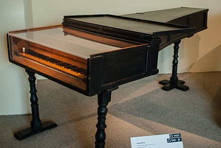
> Piano-forte de Bartolomeo Cristofori (1720)

### Le clavier
Il est composé de 88 touches. Les 52 touches blanches représentent la gamme diatonique(Do-ré-mi-fa-sol-la-si-do) de do majeur et les 36 touches noires aux cinq notes nécessaires pour finir la gamme chromatique. Généralement, le clavier contient 7 octaves et quart. 

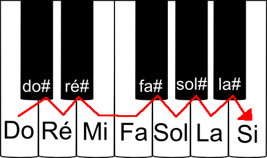
> Gamme chromatique

### Le mécanisme
le marteau est propulsé avec une pièce en forme d'équerre (le bâton d'échappement) qui bascule en arrière lorsque sa partie horizontale atteint le bouton d'échappement. Ainsi le marteau est libre de repartir en arrière dès qu'il a touché la corde, qui peut alors vibrer sans être étouffée.

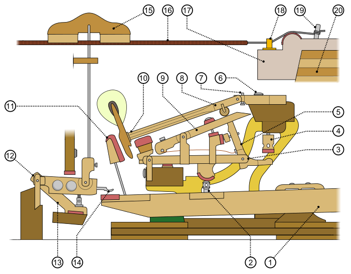
> Mécanisme d'un piano à queue

## Le synthétiseur

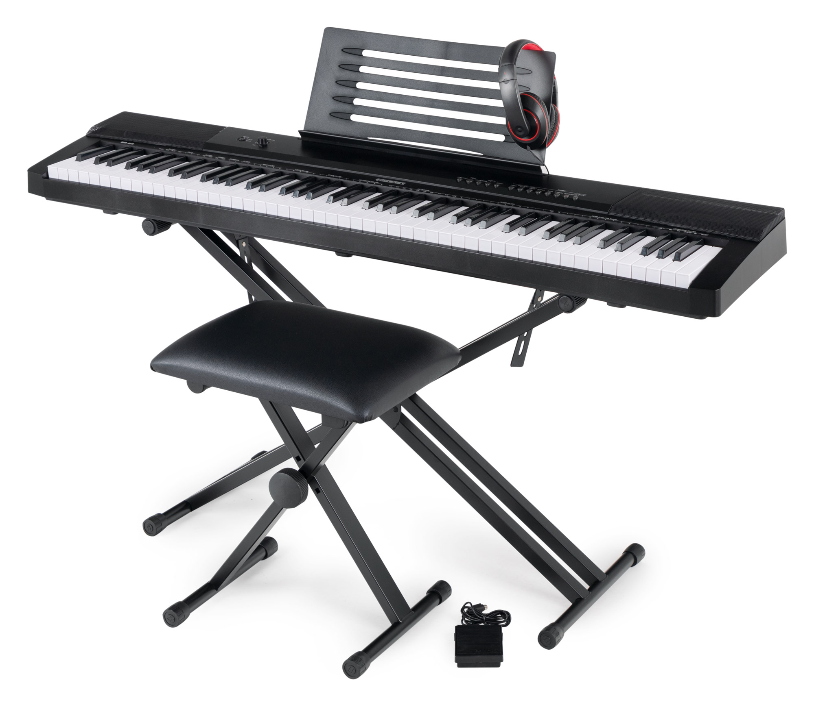

### L'histoire
En 1874, Elisha Gray invente le télégraphe musical. Il est constitué de deux octaves et utilise à travers des électro-aimants les vibrations de lamelles métalliques. La diffusion est assurée par le réseau téléphonique. La première version du synthétiseur.

> Le premier synthétiseur commercialisé (1964)

### Les contrôleurs
Un clavier peut être utilisé mais un séquenceur, un contrôleur à ruban tactile, ou grâce à des capteurs détectant la position de la main. 

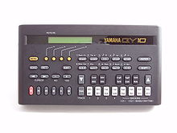
> Un séquenceur

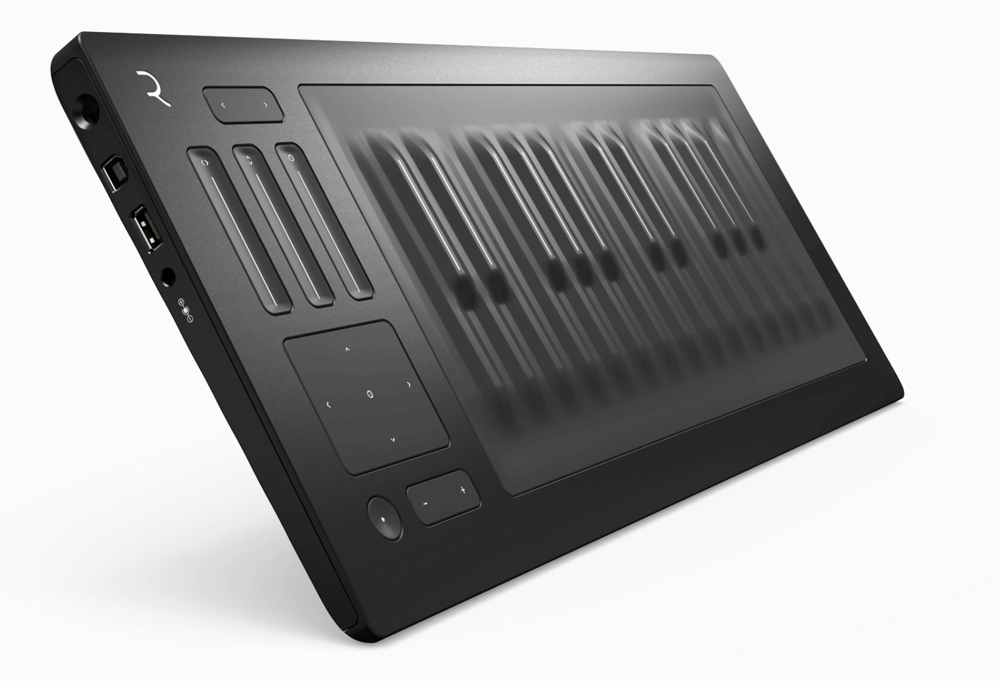
> Un contrôleur à ruban tactile

Le clavier est utilisé majoritairement lorsque le synthétiseur est sous forme physique. Certains peuvent avoir l'ajout d'un clavier compatible à l'interface MIDI ou CV/Gate. Avec le clavier, le synthétiseur propose un ensemble de potentiomètres (un type de résistance variable à trois bornes) et de faders (permet de contrôler les périphériques externes) pour le réglage du son.

### Le fonctionnement
Le son créé de manière analogique grâce à des circuits électroniques à comportement continu, de manière numérique à l'aide de circuits numériques ou à l'aide de ces deux technologies. En 1995, les microprocesseurs ont permis d'ouvrir une nouvelle voie. La synthèse sonore sur des ordinateurs personnels. L'une des méthodes consiste à reproduire les structures de synthèse d'origine en créant numériquement les circuits analogiques pour créer ou modifier des sons musicaux. 

### Les synthèses
Les plus courants, les synthèses analogiques soustractive et additive. Elles se basent sur des ondes simples. 
(Une onde sonore correspond à la propagation de perturbations mécaniques dans un milieu élastique.)
La synthèse additive combine différentes ondes sinusoïdales. (type d'ondes)

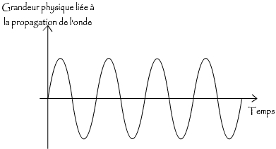
> Ondes sinusoïdales

Les synthèses soustractives utilise des signaux riches en harmoniques, et nécessite des filtres pour ajuster le ton.

### Les modules
Des modules connectés électroniquement entre-eux génèrent des sons par des circuits électroniques. Les plus récent utilise des processeurs avec l'architecture analogique. 

Les VCO, oscillateurs (la fonction est de produire un signal électrique périodique) qui créent les sons de base avec une tonalité qui dépend de la méthode de synthèse.(ensemble de techniques permettant la génération de signaux sonores)

Les VCF, filtres pour transformer le son en filtrant certaines fréquences.

Les VCA, amplificateur permettant de varier le volume.

Certains composants permettent de moduler les modules.
Les générateurs d'enveloppes permettent de moduler le son au début et à la fin d'une note.

Les LFO, permettent de moduler le son de manière périodique comme pour avoir un *vibrato* ou un *tremolo*.
(transmettre un signal par la modulation de la fréquence d'un signal porteur)

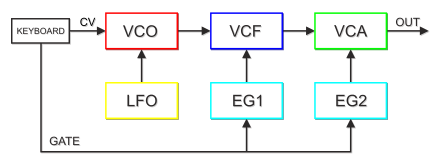
> Architecture typique d'un synthétiseur modulaire 

## Le clavier MIDI (Musical Instrument Digital Interface)

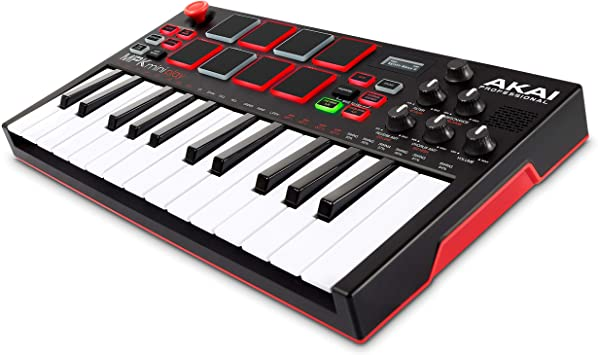

### L'histoire
Avec l'arrivée des synthétiseurs numériques, la connexion de plusieurs synthétiseurs au même clavier devient un enjeu important. Les concepteurs de synthétiseurs Dave Smith (Sequential Circuits), Ikutarō Kakehashi (Roland), et Tom Oberheim (Oberheim) se rencontrent lors du NAMM de juin 1981 pour trouver une solution à ce problème.

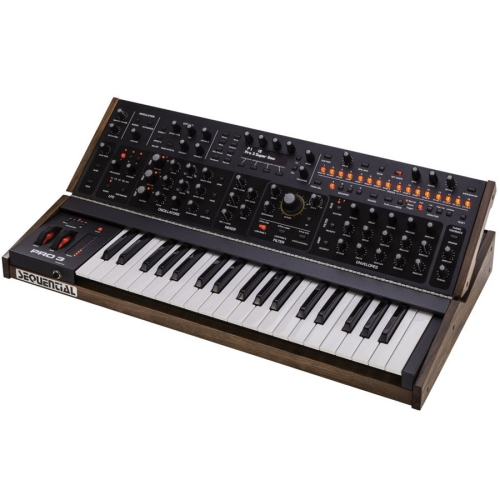
> Un synthétiseur Dave Smith

### Le clavier
Le clavier permet de générer une séquence de notes MIDI. Un clavier semblable à celui d'un piano mais largement plus petit. Il n'émet doncpas de sons toutseul mais grâce à un logiciel ou même un synthétiseur. Différentes caractéristiques sont présents: le nombre d'octaves, un toucher lourd qui s'approche de celui du piano, choisir les fonctions de vélocité et de sensibilité de pression ou diviser les commandes MIDI à travers différents canaux. Deux molette sont souvent présentes, une pour jouer sur le *pitch* (hauteur) et l'autre pour jouer avec la *modulation* (son).

### Le fonctionnement
Le fonctionnement est basé sur les messages *notes-on* et *note-off* pour faire fonctionner les notes. Une vélocité est associée aux notes pour ajuster le volume. Les notes de l'échelle chromatique sont représentées par un nombre entier codé sur 7 bits ce qui permet de coder plus de 10 octaves avec une résolution d'un demi-ton. La hauteur des notes intermédiaires sont atteintes par le *pitch-bend*. 

## Reproduire sur un logiciel

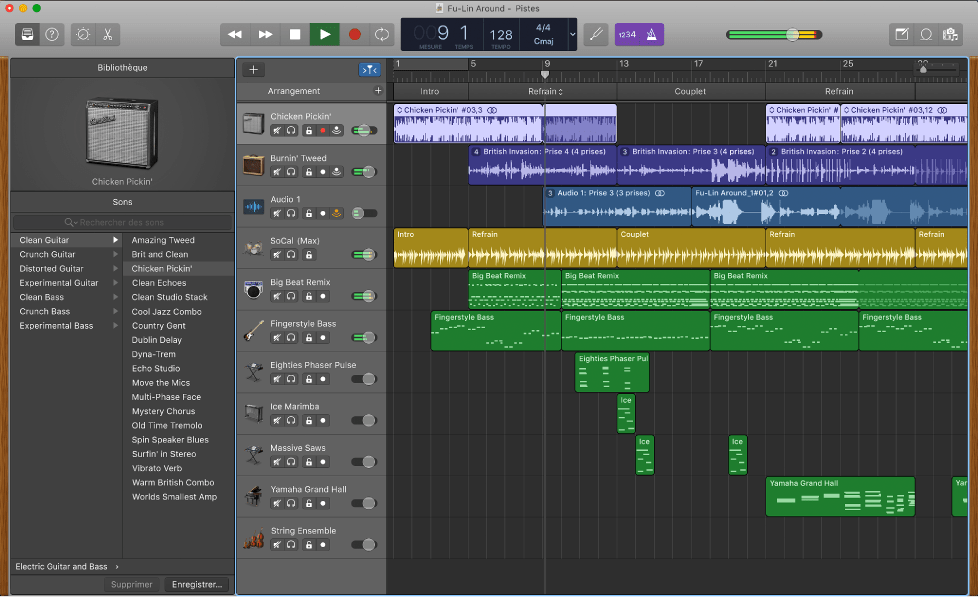
> Logiciel Garageband

### Les logiciels
On peut brancher un clavier MIDI à un synthétiseur mais se n'est pas la meilleure des options.
Les logiciels de musique sont nombreux.
Le plus abordable reste audacity qui est gratuit pour tout le monde mais objectivement pas le meilleur des logiciels. 

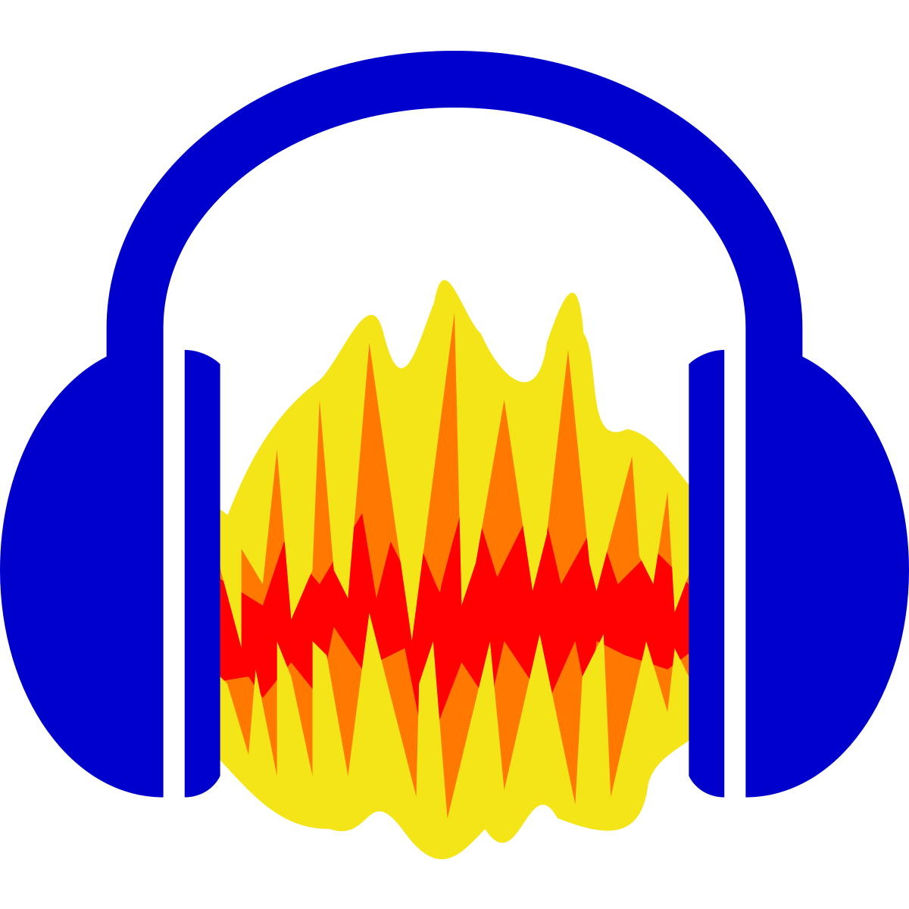
> Audacity

Par la suite, Garageband est gratuit pour toutes personnes possèdant un Mac, donc déjà mieux que audacity pour la simplicité et le prix est le même. 

> Garageband

Finalement, le meilleur logiciel reste logic pro X développé par Apple, il est complet et possède toute les fonctionnalités nécessaires mais n'est pas du tout abordable. Il coûte 279,99$.  

> Logic Pro X

### Reproduire
Le processus pour utiliser un clavier MIDI sur un logiciel n'est vraiment pas complexe. Tout d'abord, il faut le brancher à l'ordinateur avec le logiciel ouvert. Le clavier se configure automatiquement avec le logiciel et si cela ne se fait pas il faut aller dans les paramètres de périphérique et configurer le clavier. Par la suite, vous pouvez tout simplement utiliser les instruments du logiciel ou aller sur Internet télécharger des instruments pour vos compositions. 

**Faire attention, sur le clavier vous devez vous mêmes jouer les notes mais il est possible de les arranger directement dans le logiciel.**

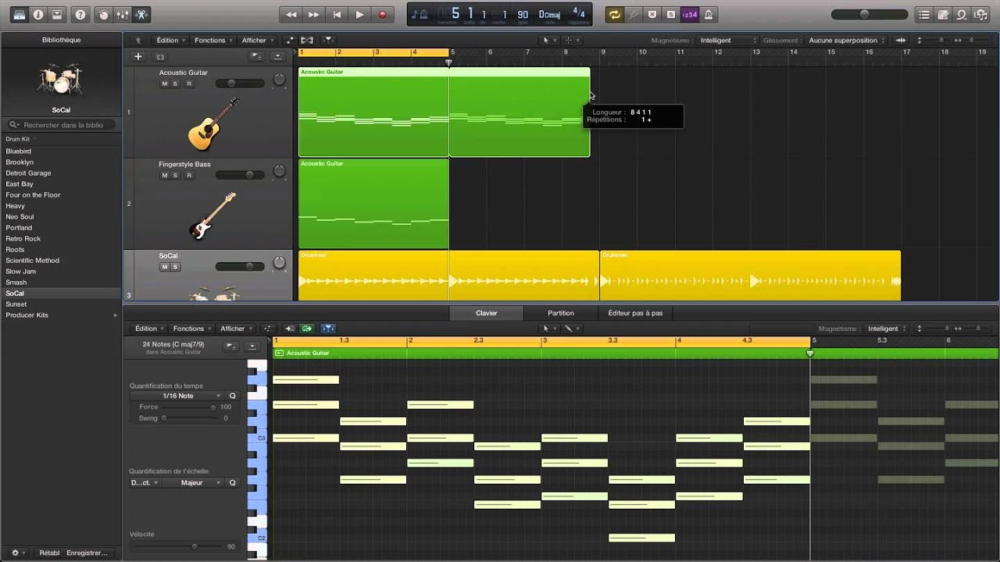

#### Sources
https://fr.yamaha.com/fr/products/contents/musical_instrument_guide/piano/structure/index.html

https://www.pianoweb.fr/histoire-du-synthetiseur.php

https://artsandculture.google.com/story/NAWhuXju46u1pg?hl=fr

https://support.apple.com/fr-ca/guide/mainstage/lgsife418e65/mac

https://arsonor.com/principes-de-fonctionnement-dun-synthetiseur-1-les-modules/#:~:text=Le%20principe%20est%20de%20g%C3%A9n%C3%A9rer,le%20terme%20de%20synth%C3%A8se%20soustractive.

https://blog.landr.com/fr/quest-ce-que-le-midi%E2%80%AF-guide-pour-debutant-sur-loutil-le-plus-puissant-de-la-musique/

https://blog.allegromusique.fr/histoire-piano-travers-epoques

https://www.guitariste.com/guides/guide-midi,5722,1.html
