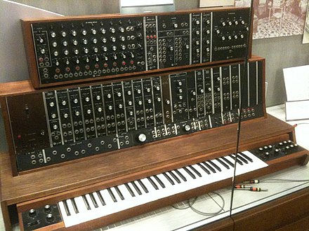

# Du piano au clavier midi
## Le piano
### L'histoire
En 1711, l'écrivain italien Scipione Maffei publie la première version du piano incluant son mécanisme (gravecembalo col piano e forte) qu'il a observé 2 ans avant. Les premiers exemplaires connus ont été fabriqués par Bartolomeo Cristofori à Florence.

> Piano-forte de Bartolomeo Cristofori (1720)

### Le clavier
Il est composé de 88 touches. Les 52 touches blanches représentent la gamme diatonique(Do-ré-mi-fa-sol-la-si-do) de do majeur et les 36 touches noires aux cinq notes nécessaires pour finir la gamme chromatique. Généralement, le clavier contient 7 octaves et quart. 

> Gamme chromatique

### Le mécanisme
le marteau est propulsé avec une pièce en forme d'équerre (le bâton d'échappement) qui bascule en arrière lorsque sa partie horizontale atteint le bouton d'échappement. Ainsi le marteau est libre de repartir en arrière dès qu'il a touché la corde, qui peut alors vibrer sans être étouffée.

> Mécanisme d'un piano à queue

## Le synthétiseur
### L'histoire
En 1874, Elisha Gray invente le télégraphe musical. Il est constitué de deux octaves et utilise à travers des électro-aimants les vibrations de lamelles métalliques. La diffusion est assurée par le réseau téléphonique. La première version du synthétiseur.

> Le premier synthétiseur commercialisé (1964)

### Les contrôleurs
Un clavier peut être utilisé mais un séquenceur, un contrôleur à ruban tactile, ou grâce à des capteurs détectant la position de la main. 

> Un séquenceur

> un contrôleur à ruban tactile

Le clavier est utilisé majoritairement lorsque le synthétiseur est sous forme physique. Certains peuvent avoir l'ajout d'un clavier compatible à l'interface MIDI ou CV/Gate. Avec le clavier, le synthétiseur propose un ensemble de potentiomètres (un type de résistance variable à trois bornes) et de faders (permet de contrôler les périphériques externes) pour le réglage du son.

### Le fonctionnement
Le son créé de manière analogique grâce à des circuits électroniques à comportement continu, de manière numérique à l'aide de circuits numériques ou à l'aide de ces deux technologies. En 1995, les microprocesseurs ont permis d'ouvrir une nouvelle voie. La synthèse sonore sur des ordinateurs personnels. L'une des méthodes consiste à reproduire les structures de synthèse d'origine en créant numériquement les circuits analogiques pour créer ou modifier des sons musicaux. 

